# 🏅 Achievement System - TanaLeague

Documentazione completa del sistema achievement: architettura, categorie, unlock automatico, e customizzazione.

---

## 📋 Indice

- [Overview](#-overview)
- [Architettura](#-architettura)
- [Categorie Achievement](#-categorie-achievement)
- [Lista Completa Achievement](#-lista-completa-achievement)
- [Auto-Unlock System](#-auto-unlock-system)
- [Aggiungere Nuovi Achievement](#-aggiungere-nuovi-achievement)
- [Customizzazione](#-customizzazione)
- [Troubleshooting](#-troubleshooting)

---

## 🎯 Overview

Il **TanaLeague Achievement System** è un sistema di gamification completo che:

- ✅ **Sblocca automaticamente** achievement durante import tornei
- ✅ **Traccia 40+ achievement** organizzati in 7 categorie
- ✅ **Assegna punti** (da 10 a 100 pt) in base a rarity
- ✅ **Mostra progresso** nei profili giocatori e pagina dedicata
- ✅ **Supporta tutti i TCG** (One Piece, Pokémon, Riftbound)

### Rarity Levels

| Rarity | Punti | Difficoltà | Colore Badge |
|--------|-------|------------|--------------|
| **Common** | 10 pt | Facile | Grigio |
| **Uncommon** | 25 pt | Media | Verde |
| **Rare** | 50 pt | Difficile | Blu |
| **Epic** | 75 pt | Molto difficile | Viola |
| **Legendary** | 100 pt | Quasi impossibile | Oro |

---

## 🏗️ Architettura

### Google Sheets Structure

Il sistema usa **2 fogli** nel Google Sheet principale:

#### 1. Achievement_Definitions

Definisce i 40 achievement con tutte le info necessarie.

**Columns**:
```
achievement_id | name | description | category | rarity | emoji | points | requirement_type | requirement_value
```

**Esempio riga**:
```
ACH_GLO_001 | First Blood | Vinci il tuo primo torneo | Glory | Uncommon | 🎬 | 25 | tournament_wins | 1
```

**Requirement Types**:
- `tournaments_played`: Contatore tornei giocati
- `tournament_wins`: Contatore vittorie
- `top8_count`: Contatore top8
- `special`: Logica complessa (implementata in `achievements.py`)

#### 2. Player_Achievements

Traccia achievement sbloccati da ogni giocatore.

**Columns**:
```
membership | achievement_id | unlocked_date | tournament_id | progress
```

**Esempio riga**:
```
0000012345 | ACH_GLO_001 | 2024-11-15 | OP12_2024-11-15 | 1/1
```

### File Structure

```
tanaleague2/
├── setup_achievements.py      # Script setup iniziale (run once)
├── achievements.py             # Core logic + unlock functions
├── import_onepiece.py        # One Piece import (con achievement unlock)
├── import_pokemon.py        # Pokemon import (con achievement unlock)
├── import_riftbound.py         # Riftbound import (con achievement unlock)
├── app.py                      # Flask routes (profili, pagina achievement)
└── templates/
    ├── player.html             # Profilo con achievement sbloccati
    └── achievements.html       # Catalogo completo achievement
```

### Workflow Auto-Unlock

```mermaid
graph TD
    A[Import Torneo] --> B[Calcola Stats Giocatori]
    B --> C[Load Achievement Definitions]
    C --> D[Per ogni giocatore]
    D --> E{Check Simple Achievements}
    E --> F{Check Special Achievements}
    F --> G{Nuovo Achievement?}
    G -->|Sì| H[Unlock Achievement]
    G -->|No| I[Skip]
    H --> J[Scrivi in Player_Achievements]
    J --> K[Print Console]
    K --> D
    I --> D
    D --> L[Completato]
```



**Passaggi**:
1. Script import (CSV/PDF/TDF) processa torneo
2. Scrive dati in Results, Tournaments, Players
3. Aggiorna Seasonal_Standings
4. Chiama `check_and_unlock_achievements(sheet, import_data)`
5. Per ogni giocatore del torneo:
   - Carica achievement già sbloccati
   - Calcola stats lifetime aggiornate
   - Check achievement semplici (contatori)
   - Check achievement special (logica custom)
   - Sblocca nuovi achievement
6. Output console con achievement sbloccati

---

## 🎪 Categorie Achievement

### 🏆 Glory (7 achievement)

**Descrizione**: Trionfi e vittorie memorabili

| ID | Nome | Descrizione | Rarity | Pt | Unlock |
|----|------|-------------|--------|----|----|
| ACH_GLO_001 | First Blood | Vinci il tuo primo torneo | Uncommon | 25 | 1 vittoria |
| ACH_GLO_002 | King of the Hill | Vinci 3 tornei | Rare | 50 | 3 vittorie |
| ACH_GLO_003 | Champion | Vinci 5 tornei | Rare | 50 | 5 vittorie |
| ACH_GLO_004 | Legend | Vinci 10 tornei | Epic | 75 | 10 vittorie |
| ACH_GLO_005 | Perfect Storm | Vinci torneo senza perdere mai | Rare | 50 | Vittoria 4-0 o 5-0 |
| ACH_GLO_006 | Undefeated Season | Vinci tutti i tornei di una stagione (min 4) | Legendary | 100 | 100% win rate in stagione |
| ACH_GLO_007 | Podium Climber | Top 3 in almeno 5 tornei | Uncommon | 25 | 5 top3 |

---

### ⚔️ Giant Slayer (6 achievement)

**Descrizione**: Batti i migliori e sovverti le gerarchie

| ID | Nome | Descrizione | Rarity | Pt | Unlock |
|----|------|-------------|--------|----|----|
| ACH_GIA_001 | Dragonslayer | Batti il rank #1 stagionale in uno scontro | Rare | 50 | Beat rank 1 H2H |
| ACH_GIA_002 | Kingslayer | Batti un campione (10+ vittorie) | Uncommon | 25 | Beat player con 10+ wins |
| ACH_GIA_003 | Gatekeeper | Elimina qualcuno dai top8 battendolo | Uncommon | 25 | Win vs player finito 9° |
| ACH_GIA_004 | Upset Artist | Vinci partendo da seed basso (<16°) | Rare | 50 | Vittoria da seed 16+ |
| ACH_GIA_005 | Dark Horse | Top 3 da ultimo posto Swiss | Epic | 75 | Top3 da seed ultimo |
| ACH_GIA_006 | Cinderella Run | Vinci da seed basso (<16°) | Legendary | 100 | Vittoria da seed 16+ |

---

### 📈 Consistency (8 achievement)

**Descrizione**: Costanza, serie positive, e performance regolari

| ID | Nome | Descrizione | Rarity | Pt | Unlock |
|----|------|-------------|--------|----|----|
| ACH_CON_001 | Hot Streak | 2 top8 consecutivi | Uncommon | 25 | Streak 2 |
| ACH_CON_002 | On Fire | 3 top8 consecutivi | Rare | 50 | Streak 3 |
| ACH_CON_003 | Unstoppable Force | 4 top8 consecutivi | Rare | 50 | Streak 4 |
| ACH_CON_004 | Untouchable | 6 top8 consecutivi | Legendary | 100 | Streak 6 |
| ACH_CON_005 | Season Warrior | Almeno 1 top8 in 8+ tornei stagionali | Rare | 50 | 8 top8 in 1 stagione |
| ACH_CON_006 | Iron Wall | 5 top8 in fila SENZA vincere mai | Rare | 50 | 5 top8, 0 vittorie |
| ACH_CON_007 | Metronome | Stesso piazzamento per 3 tornei di fila | Uncommon | 25 | 3x stesso rank |
| ACH_CON_008 | Swiss Specialist | 10+ tornei senza mai dropare | Uncommon | 25 | 10 tornei completi |

---

### 🌍 Legacy (8 achievement)

**Descrizione**: Longevità, partecipazione, e milestone lifetime

| ID | Nome | Descrizione | Rarity | Pt | Unlock |
|----|------|-------------|--------|----|----|
| ACH_LEG_001 | Debutto | Gioca il tuo primo torneo | Common | 10 | 1 torneo |
| ACH_LEG_002 | Regular | Gioca 5 tornei | Common | 10 | 5 tornei |
| ACH_LEG_003 | Veteran | Gioca 15 tornei | Uncommon | 25 | 15 tornei |
| ACH_LEG_004 | Lifer | Gioca 30 tornei | Rare | 50 | 30 tornei |
| ACH_LEG_005 | Gladiator | Gioca 50 tornei | Epic | 75 | 50 tornei |
| ACH_LEG_006 | Hall of Famer | Gioca 100 tornei | Legendary | 100 | 100 tornei |
| ACH_LEG_007 | Triple Threat | Gioca almeno 3 tornei in tutti i TCG | Rare | 50 | 3+ tornei per TCG |
| ACH_LEG_008 | Triple Crown | Vinci torneo in tutti e 3 i TCG | Epic | 75 | 1 win per TCG |

---

### 🎪 Wildcards (4 achievement)

**Descrizione**: Achievement bizzarri, divertenti, casuali

| ID | Nome | Descrizione | Rarity | Pt | Unlock |
|----|------|-------------|--------|----|----|
| ACH_WIL_001 | Lucky Seven | Finisci esattamente 7° | Uncommon | 25 | Rank 7 |
| ACH_WIL_002 | The Answer | Totalizza esattamente 42 punti | Rare | 50 | 42 punti in torneo |
| ACH_WIL_003 | Balanced | Finisci con record 2-2 | Common | 10 | Record 2W-2L |
| ACH_WIL_004 | Bronze Collector | Finisci 3° almeno 3 volte | Uncommon | 25 | 3x rank 3 |

---

### ⏰ Seasonal (3 achievement)

**Descrizione**: Performance stagionali specifiche

| ID | Nome | Descrizione | Rarity | Pt | Unlock |
|----|------|-------------|--------|----|----|
| ACH_SEA_001 | Opening Act | Vinci il primo torneo della stagione | Rare | 50 | Win 1st tournament |
| ACH_SEA_002 | Grand Finale | Vinci l'ultimo torneo della stagione | Rare | 50 | Win last tournament |
| ACH_SEA_003 | Season Sweep | Top8 in tutti i tornei di una stagione | Legendary | 100 | 100% top8 rate |

---

### 💔 Heartbreak (8 achievement)

**Descrizione**: Sfortune, quasi vittorie, e momenti difficili

| ID | Nome | Descrizione | Rarity | Pt | Unlock |
|----|------|-------------|--------|----|----|
| ACH_HEA_001 | Rookie Struggles | Primi 3 tornei con massimo 3 vittorie totali | Common | 10 | ≤3 W in primi 3 |
| ACH_HEA_002 | So Close | Finisci 2° | Common | 10 | Rank 2 |
| ACH_HEA_003 | Forever Second | Finisci 2° almeno 3 volte SENZA mai vincere | Rare | 50 | 3x rank 2, 0 wins |
| ACH_HEA_004 | Gatekeeper's Victim | Finisci 9° (fuori dai top8) | Common | 10 | Rank 9 |
| ACH_HEA_005 | Ninth Circle | Finisci 9° almeno 3 volte | Uncommon | 25 | 3x rank 9 |
| ACH_HEA_006 | Storm Cloud | 10+ tornei senza MAI fare top8 | Rare | 50 | 10 tornei, 0 top8 |
| ACH_HEA_007 | The Grind | 20+ tornei con max 2 top8 totali | Epic | 75 | 20 tornei, ≤2 top8 |
| ACH_HEA_008 | Participation Trophy | Ultimo posto in torneo 16+ persone | Common | 10 | Rank = ultimo |

---

## 📜 Lista Completa Achievement

### Achievement per Rarity

**Legendary (100pt)**: 5 achievement
- Undefeated Season
- Untouchable
- Hall of Famer
- Season Sweep
- Cinderella Run

**Epic (75pt)**: 5 achievement
- Legend
- Dark Horse
- Gladiator
- Triple Crown
- The Grind

**Rare (50pt)**: 15 achievement
- King of the Hill, Champion, Perfect Storm
- Dragonslayer, Upset Artist
- On Fire, Unstoppable Force, Season Warrior, Iron Wall
- Lifer, Triple Threat
- The Answer
- Opening Act, Grand Finale
- Forever Second, Storm Cloud

**Uncommon (25pt)**: 12 achievement
- First Blood, Podium Climber
- Kingslayer, Gatekeeper
- Hot Streak, Metronome, Swiss Specialist
- Veteran
- Lucky Seven, Bronze Collector
- Ninth Circle

**Common (10pt)**: 8 achievement
- Debutto, Regular
- Balanced
- Rookie Struggles, So Close, Gatekeeper's Victim, Participation Trophy

**TOTALE PUNTI DISPONIBILI**: 1755 pt

---

## 🤖 Auto-Unlock System

### Requirement Types

Gli achievement usano 2 tipi di unlock logic:

#### 1. Simple Requirements (Contatori)

Achievement basati su contatori semplici.

**Tipi**:
- `tournaments_played`: Numero tornei giocati
- `tournament_wins`: Numero vittorie
- `top8_count`: Numero top8

**Esempio**:
```python
# ACH_LEG_003: Veteran - 15 tornei
requirement_type = "tournaments_played"
requirement_value = "15"

# Check in achievements.py
if stats['tournaments_played'] >= 15:
    unlock_achievement(sheet, membership, 'ACH_LEG_003', tournament_id)
```

#### 2. Special Requirements (Logica Custom)

Achievement con logica complessa implementata in `achievements.py`.

**Tipi**:
- `streak_top8_N`: N top8 consecutivi
- `rookie_struggles`: Primi 3 tornei con ≤3 vittorie
- `rank9_3x`: Finito 9° almeno 3 volte
- `second_3x_no_wins`: 2° almeno 3 volte senza vittorie
- `10tournaments_no_top8`: 10 tornei senza top8
- `rank_7`: Finito esattamente 7°
- `rank3_3x`: 3° almeno 3 volte
- `multi_tcg_3+`: Almeno 3 tornei in 2+ TCG
- `top8_2tcg`: 2+ top8 in 2+ TCG
- `win_all_tcg`: Vittoria in tutti e 3 i TCG

**Esempio**:
```python
# ACH_CON_003: Unstoppable Force - 4 top8 consecutivi
requirement_type = "special"
requirement_value = "streak_top8_4"

# Check in achievements.py
if stats['max_streak_top8'] >= 4:
    unlock_achievement(sheet, membership, 'ACH_CON_003', tournament_id, f"{max_streak_top8}/4")
```

### Calcolo Stats

La funzione `calculate_player_stats()` in `achievements.py` calcola tutte le stats lifetime del giocatore:

```python
stats = {
    'tournaments_played': 25,           # Tornei totali
    'tournament_wins': 3,                # Vittorie totali
    'top8_count': 12,                    # Top8 totali
    'best_rank': 1,                      # Miglior piazzamento
    'max_streak_top8': 4,                # Streak top8 massima
    'tcgs_played': {'OP', 'PKM'},        # TCG giocati
    'tcg_wins': {'OP': 2, 'PKM': 1},     # Vittorie per TCG
    'tcg_top8': {'OP': 8, 'PKM': 4},     # Top8 per TCG
    'rank_frequency': {1: 3, 2: 2, 3: 1, 9: 2},  # Frequenza rank
    'first_3_wins': 5,                   # Vittorie nei primi 3 tornei
    'player_results': [...]              # Lista completa risultati
}
```

### Console Output

Durante import, achievement sbloccati vengono mostrati in console:

```
🎮 Check achievement...
  📋 40 achievement caricati
  🏆 0000012345: 🎬 First Blood
  🏆 0000067890: 📅 Regular
  🏆 0000012345: 🔥 Hot Streak (3/2)
  ✅ 3 achievement sbloccati!
```

---

## ➕ Aggiungere Nuovi Achievement

### Step-by-Step

#### 1. Aggiungi in Achievement_Definitions Sheet

Apri Google Sheet, vai su foglio `Achievement_Definitions`, aggiungi riga:

**Esempio nuovo achievement**:
```
ACH_WIL_005 | Perfectionist | Vinci con 100% game win rate | Wildcards | Epic | 🎯 | 75 | special | perfect_game_win_rate
```

#### 2. Implementa Logica (se `special`)

Se `requirement_type = "special"`, aggiungi logica in `achievements.py`:

**File**: `tanaleague2/achievements.py`

**Funzione**: `check_special_achievements()`

```python
def check_special_achievements(stats, achievements, unlocked, current_tournament):
    to_unlock = []

    for ach_id, ach in achievements.items():
        if ach_id in unlocked:
            continue

        if ach['requirement_type'] != 'special':
            continue

        req_value = ach['requirement_value']

        # === AGGIUNGI QUI IL TUO ACHIEVEMENT ===

        # Esempio: Perfect Game Win Rate
        if req_value == 'perfect_game_win_rate':
            # Logica: Vittoria con 100% game win (es. 2-0 in tutti i match)
            # Richiede match data da current_tournament
            if current_tournament.get('rank') == 1 and current_tournament.get('game_win_rate') == 1.0:
                to_unlock.append((ach_id, "100% GW"))

        # Altro achievement...

    return to_unlock
```

#### 3. Test

Esegui import di test:

```bash
cd tanaleague2
python import_onepiece.py --csv test.csv --season OP12 --test
```

Verifica output:
```
🎮 Check achievement...
  🏆 0000012345: 🎯 Perfectionist (100% GW)
  ✅ 1 achievement sbloccato!
```

#### 4. Deploy

Se tutto OK, rimuovi `--test` e esegui import reale.

---

## 🎨 Customizzazione

### Cambiare Punti Achievement

**File**: Google Sheet `Achievement_Definitions`

Modifica colonna `points`:
```
ACH_GLO_001 | First Blood | ... | 25  →  50
```

I punti vengono letti dinamicamente dalla webapp.

### Cambiare Rarity

**File**: Google Sheet `Achievement_Definitions`

Modifica colonna `rarity`:
```
ACH_GLO_001 | First Blood | ... | Uncommon  →  Rare
```

Colori badge si aggiornano automaticamente.

### Cambiare Emoji

**File**: Google Sheet `Achievement_Definitions`

Modifica colonna `emoji`:
```
ACH_GLO_001 | First Blood | ... | 🎬  →  🏆
```

### Nascondere Achievement dalla UI

Per nascondere achievement senza cancellarlo:

**Opzione 1**: Rinomina `achievement_id` aggiungendo `_HIDDEN`:
```
ACH_GLO_001  →  ACH_GLO_001_HIDDEN
```

**Opzione 2**: Filtra in `app.py` route `/achievements`:

```python
@app.route('/achievements')
def achievements():
    ws = sheet.worksheet("Achievement_Definitions")
    rows = ws.get_all_values()[4:]

    achievements = []
    for row in rows:
        if row and row[0]:
            # Skip achievement nascosti
            if row[0].endswith('_HIDDEN'):
                continue

            achievements.append({...})
```

### Creare Categorie Custom

Per aggiungere nuova categoria (es. "Season Specific"):

1. In Google Sheet, aggiungi achievement con `category = "Season Specific"`
2. In `templates/achievements.html`, aggiungi colore header:

```html
bg-teal text-white
```

3. In `app.py`, il grouping by category è automatico

---

## 🔧 Troubleshooting

### Achievement non si sbloccano

**Causa possibile**:
- Sheet `Player_Achievements` non esiste
- Achievement già sbloccato in precedenza
- Logica `special` ha bug

**Debug**:

1. Verifica sheet esiste:
```bash
cd tanaleague2
python3
>>> import gspread
>>> # ... connetti a sheet
>>> sheet.worksheet("Player_Achievements")
```

2. Verifica achievement non già sbloccato:
```bash
# Nel Google Sheet Player_Achievements
# Cerca membership + achievement_id
```

3. Test logica con print:
```python
# In achievements.py, aggiungi print debug
if req_value == 'streak_top8_4':
    print(f"  DEBUG: max_streak = {stats['max_streak_top8']}")
    if stats['max_streak_top8'] >= 4:
        ...
```

### Achievement sbloccato ma non appare in profilo

**Causa**: Cache webapp

**Soluzione**:
1. Refresh cache: Visita `/api/refresh`
2. Hard refresh browser: `Ctrl+Shift+R`
3. Ricarica pagina profilo

### Import fallisce con errore achievement

**Causa**: `Achievement_Definitions` sheet non trovato

**Soluzione**:
```bash
cd tanaleague2
python setup_achievements.py
```

### Punti non aggiornati

**Causa**: Calcolo punti fatto in webapp, non in sheet

**Soluzione**: I punti achievement sono calcolati in `app.py` route `/player/<membership>`:

```python
achievement_points = sum(ach['points'] for ach in achievements_unlocked)
```

Se non si aggiornano, verifica che achievement definitions abbiano `points` corretto.

---

## 📊 Achievement Analytics

### Query Utili

**Achievement più sbloccato**:

Apri Google Sheet `Player_Achievements`, usa formula:
```
=QUERY(A:B, "SELECT B, COUNT(B) GROUP BY B ORDER BY COUNT(B) DESC")
```

**Giocatore con più achievement**:
```
=QUERY(A:B, "SELECT A, COUNT(A) GROUP BY A ORDER BY COUNT(A) DESC")
```

**Achievement mai sbloccato**:

Confronta `Achievement_Definitions` column A con `Player_Achievements` column B.

### Statistiche da Webapp

Pagina `/achievements` mostra per ogni achievement:
- **Unlock count**: Quanti giocatori l'hanno sbloccato
- **Unlock percentage**: % sul totale giocatori
- **Progress bar**: Visualizzazione grafica

---

## 🚀 Roadmap Future

### Achievement Fase 2 (TODO)

Achievement attualmente **non implementati** (richiede match data):

- **Perfect Storm** (vittoria senza sconfitte) - Richiede W-L-D parsing
- **Dragonslayer** (beat rank 1 H2H) - Richiede match H2H data
- **Dark Horse** (top3 da ultimo seed) - Richiede seeding info
- **Opening Act / Grand Finale** - Richiede torneo season date
- **Season Sweep** (100% top8 in stagione) - Richiede seasonal filtering

Per implementarli:

1. **Estendere import scripts** per salvare:
   - W-L-D record per giocatore
   - Match H2H (chi ha battuto chi)
   - Seeding iniziale
   - Date tornei per identificare primo/ultimo

2. **Modificare `current_tournament` dict** in `check_and_unlock_achievements()`:
```python
current_tournament = {
    'rank': 1,
    'record': '4-0-0',  # W-L-D
    'seed': 12,
    'opponents_beaten': ['0000067890', '0000054321'],
    'game_win_rate': 1.0,
    'is_first_tournament': True,
    'is_last_tournament': False
}
```

3. **Implementare check** in `check_special_achievements()`

---

**Achievement System completo e funzionale! 🎉**

Per domande o supporto → [TROUBLESHOOTING.md](TROUBLESHOOTING.md)
